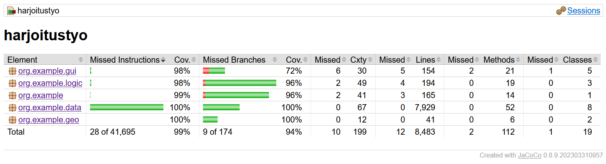

# Testaus

Huom! Kaikkien testien ajamiseen menee jonkin verran aikaa, useita minuutteja melko tehokkaallakin tietokoneella. Testit voi ajaa git repositoryssä:

```
./gradlew test
```

## Yksikkötestauksen kattavuusraportti

Yksikkötestien kattavuus on melko suuri, suoritettavien käskyjen osalta 99% ja ohjelman haarojen osalta 94%.

Kun testit on ajettu, automaattisesti generoitunut Jacoco-raportti (HTML) löytyy alihakemistosta **build/jacocoHtml**. Raportin päätiedosto on **build/jacocoHtml/index.html**.



## Mitä testattiin ja miten?

Ohjelman toiminnallisuutta on testattu varsin laajasti, kenties algoritmeja lukuunottamatta. Komentorivitoiminnallisuutta testataan luokassa org.example.MainTest, Geografisen laskennan toiminnallisuutta luokassa org.example.geo.GeoUtilTest ja myös org.example.data.Airport* -luokkien toiminnallisuus testataan. Näiden avulla saadaan varsin suuri yksikkötestien kattavuus koko lähdekoodin osalta.

Algoritmien osalta sekä Dijkstran että IDA*:n testaus on identtistä. Testataan kahta asiaa: sitä, että reittiä ei löydy, ja reitin etsimistä erilaisilla rangeilla. 

## Minkälaisilla syötteillä testaus tehtiin?

Testaus tehtiin Dijkstran ja IDA* -algiritmien osalta hakemalla reittejä samoilla lähtö- ja kohdekentillä. Käytettävät lähtö- ja kohdelentokentät ovat samat, ja riippuvat käytetystä datasetistä (world tai Finland).

Mikäli käytössä on datasetti world, lähtökenttä on Helsinki-Vantaa ja kohdekenttä on Vancouver International. Reittiä ei löydy, jos kantama on 200km. Muilla testattavilla rangeilla reitti löytyy, ja tarkistetaan, että kun kantamaa kasvatetaan, reitin välilaskujen (hop) määrä vähenee.

Kun datasetti on Finland, lähtökenttä on Helsinki-Vantaa ja kohdekenttä on Rovaniemi. Reittiä ei löydy, jos kantama on 50km, muissa tapauksissa reitti löytyy. Tätäkin tapausta testataain eri kantamilla.

## Testien toistettavuus

Testit ovat sikäli toistettavia, että niissä ei käytetä satunnaissyötteitä. Täten testien pitäisi antaa identtiset tulokset kaikilla suorituskerroilla.

## Testien puutteita

Testaus on sikäli puutteellista, että tehdyillä testeillä ei varsinaisesti testata sitä, että löydetyt reitit todella ovat lyhimpiä mahdollisia. Tämä olisi todennäköisesti mahdollista tarkistaa ainoastaan esim. Finland-datasetillä, etsien käsin lyhimmät reitit ja vertailemalla niitä algoritmien löytämiin. Myöskään mitään erikoisia tilanteita ei tarkisteta. Oikeastaan testauksessa lähtökohta onkin, että algoritmien löytämät reitit ovat lyhimmät mahdolliset ja oikein.
