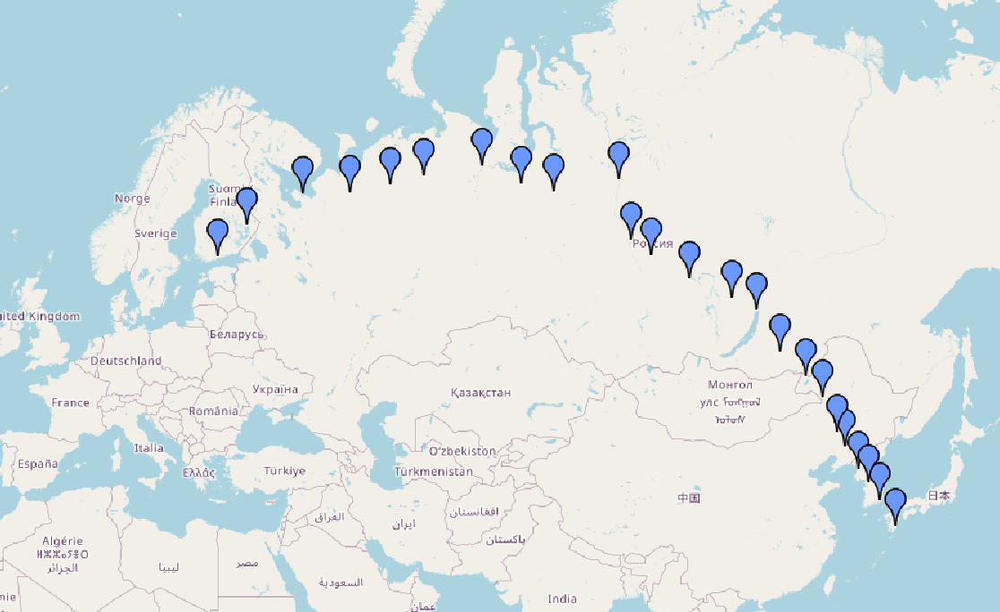
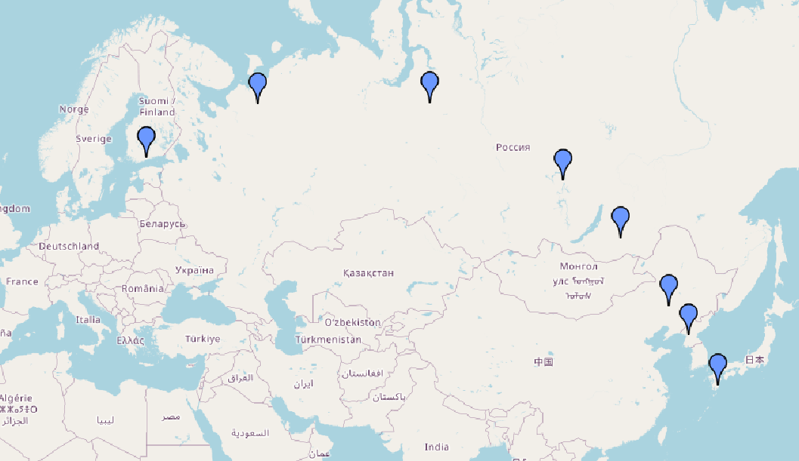
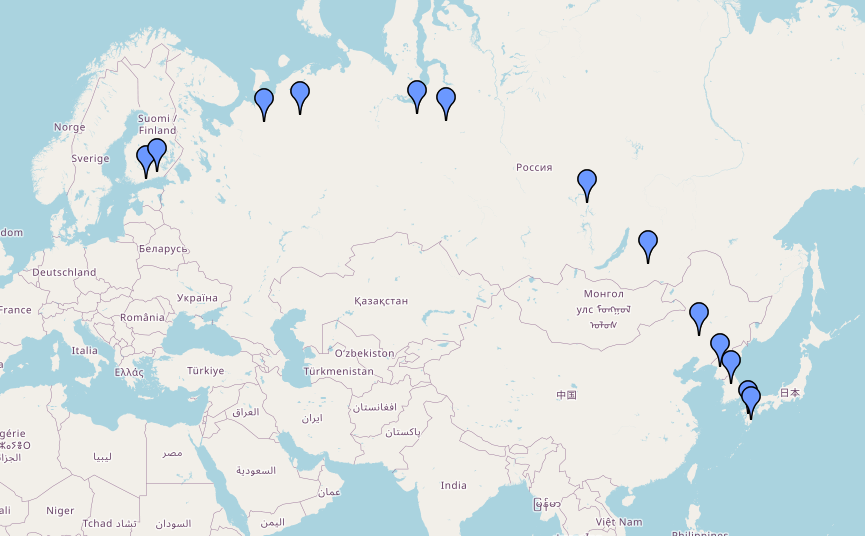

# Toteutus

## Ohjelman yleisrakenne

Ohjelma on jaettu useampaan osioon lähdekoodin tasolla:

- org.example.Main - komentoriviargumenttien mukaan tapahtuva toiminnallisuuden laukaisu
- org.example.data.* - datan importtaamiseen tarvittava toiminnallisuus, sekä tarvittavat datarakenteet
- org.example.gui.* - graafiseen käyttöliittymään liittyvät ominaisuudet, esim. kartta
- org.example.geo - Geografiseen laskentaan liittyvä toiminnallisuus, esim. kahden pisteen välinen etäisyys
- org.example.logic.* - varsinaiset algoritmit (Dijkstra & IDA*, sekä Dijkstraa varten tehty oma implementaatio PriorityQueue:sta) 

Hakemistossa org.example.Data löytyvät luokat Airport*, joiden avulla mallinnetaan lentokenttien välisiä graafeja.

Kun ohjelman reitinlaskentaan käytettävä toiminnallisuus käynnistetään, ohjelma muodostaa ensin annetun lentokonekantaman (kilometreissä) perusteella graafin, jota käytetään laskennassa. Tämä graafin muodostamisen toiminnallisuus löytyy luokasta org.example.data.AirportDataGenerator metodista generateAirportGraph.

Kun graafi on laskettu, käynnistetään Dijkstra tai IDA* -haku, jotka löytyvät luokista org.example.Logic.{DijkstraSearch,IdastarSearch}. Jos reitti löytyy, näytetään lopputulos graafisena karttaesityksenä käyttäen org.example.gui.* -luokkia.

Algoritmit on toteutettu käyttäen Wikipedian pseudokoodia ko. algoritmin sivuilla, Dijkstra: [1], IDA*: [2]. Lisäksi oman Priority Queue -implementaationa inspiraationa on toiminut Binary Heap [3].

- [1] https://en.wikipedia.org/wiki/Dijkstra%27s_algorithm#Using_a_priority_queue
- [2] https://en.wikipedia.org/wiki/Iterative_deepening_A*#Pseudocode
- [3] https://www.geeksforgeeks.org/binary-heap/

## Saavutetut aika- ja tilavaativuudet

Kun Dijkstraa testattiin välillä Helsinki-Vantaa -> Miyazaki, Japani, se löysi reitin kaikilla kantamilla alle sekunnissa. IDA* suoriutui useista reittihauista alle sekunnissa, mutta joissain tapauksissa reitin laskemiseen kului aikaa useita sekunteja. IDA*:n timeout oli kymmenessä sekunnissa, ja useissa tapauksissa laskenta ylitti tämän. Tämä saattaa johtua siitä, että IDA* ei pidä kirjaa jo läpikäydyistä solmuista, vaan käy joissain tapauksissa verkkoa uudestaan ja uudestaan läpi.

Dijkstra vaati kuitenkin huomattavasti isomman muistitilan kuin IDA*. Tällä verkon koolla (hieman vajaa 8000 lentokenttää) muistivaativuus oli jo yli gigatavun luokkaa. Tämä johtuu siitä, että Dijkstra käyttää airportDistances-matriisia, jossa on kaikkien lentokenttien keskinäiset etäisyydet. Tämän matriisin koko on siis **numberOfAirports^2**. 

Tarkempaa O-analyysiä ei tehty.

## Suorituskyky- ja O-analyysivertailu

IDA*-algoritmissä käytetty heuristiikka löytyy metodista org.example.logic.IdastarSearch.heuristic, ja lasketaan ko. lentokentän suorasta etäisyydestä kohdekenttään. Tällöin heuristiikka on "admissible", eli aina pienempi kuin varsinaisen reitin pituus. Algoritmin tulisi siis löytää lyhin reitti.  

Huomionarvoista on se, että joillain syötteillä IDA* räjähtää niin, että sen tekemä laskenta on huomattavasti hitaampaa kuin Dijkstran vastaava. Dijkstra vaikutti toimivan kaikilla syötteillä, eli joko löysi reitin nopeasti tai sitten, jos reittiä ei ollut, palautti tämänkin vastauksen nopeasti. IDA* käytti joihinkin tapauksiin niin pitkän aikaa, että en jäänyt odottelemaan laskennan valmistumista. Timeout on IDA*:lla 10 sekuntia, ja tätä timeoutia ei tarvittu Dijkstrassa.

En testannut, mutta arvelisin tämän johtuvan siitä, että IDA* on haavoittuvainen isolle branching factorille. Lentokentällä voi olla useita kymmeniä kohdelentokenttiä reitin seuraavaa pistettä varten.

Toinen huomionarvoinen seikka on se, että IDA* löysi Dijkstran kanssa yhtä lyhyitä reittejä, mutta Dijkstra suosi pienempiä välilaskumääriä kuin IDA*. Esim. alla olevassa Helsinki-Vantaa -> Miyazaki -reitissä 1500km kantamalla Dijkstra löysi reitin, jossa oli 8 lentokenttää, kun IDA* löysi reitin, jossa oli 13 lentokenttää. Reittien pituudet kilometreissä olivat kuitenkin identtiset. Tämä johtunee siitä, että IDA*-algoritmissä Priority Queue:ssa tutkitaan ensin seuraavan pisteen lentokenttiä, jotka ovat mahdollisimman lähellä reitin edellistä lentokenttää.  

O-analyysiä ei tehty.

## Löydettyjä reittejä

### Dijkstra: Helsinki-Vantaa -> Miyazaki, Japani, range: 500km

"total distance: 8165 km, number of hops: 24"

### IDA*: Helsinki-Vantaa -> Miyazaki, Japani, range: 500km

Ei löytänyt reittiä - timeout (10 sekuntia).

### Dijkstra: Helsinki-Vantaa -> Miyazaki, Japani, range: 1500km

"total distance: 7810 km, number of hops: 8"

### IDA*: Helsinki-Vantaa -> Miyazaki, Japani, range: 1500km

"total distance: 7810 km, number of hops: 13"

## Puutteet ja parannusehdotukset

Ohjelman puutteeksi voidaan laskea se, että suuri osa toiminnallisuudesta on toteutettu komentoriviargumentteina, ja graafista käyttöliittymää ei ole hiottu. Kaikki toiminnallisuus olisi hyvä implementoida UI-elementteinä, jos oltaisiin tekemässä "varsinaista" ohjelmistoa. Esim. lentokone olisi hyvä pystyä valitsemaan dropdown-menusta tai vastaavasta.

Kartan puutteita ovat:

- Ei karttanavigaatiotoiminnallisuutta UI-elementteinä (zoom in / out)
- Kartan markerit eivät ole kovin kuvaavia, eikä niistä ilmene esim. hiiren kursorin avulla lentokentän nimeä
- Vasemman kolumnin reittinäyttö on varsin yksinkertainen. Esim. jos hiiren kursorin siirtää reitillä olevan lentokentän nimen päälle, ko. lentokentän markerin voisi korostaa jotenkin. 

Ehkä isompi puute on se, että ohjelmassa ei ole toiminnallisuutta piirtää yhtäaikaisesti kartalle sekä Dijkstran että IDA*:n löytämää reittiä, jotta niitä voisi vertailla. Useissa tapauksissa reitti on kuitenkin identtinen.

Testauksen isoin puute on sen tarkistaminen, että löydetyt reitit todella ovat lyhimpiä.

Dokumentaation pahin puute on aikavaativuuksien tarkemman analyysin puuttuminen.
